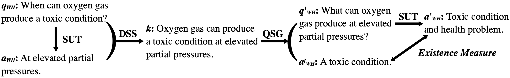
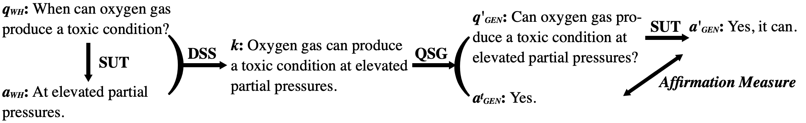
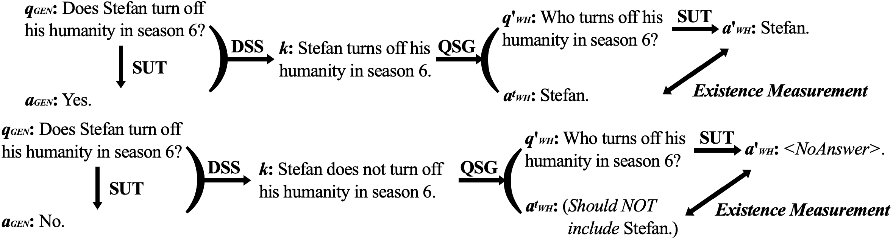

# Artifact for the Paper "Testing Your Question Answering Software via Asking Recursively"

This is the artifact for the *ASE 2021 Research Track* paper "***Testing Your Question Answering Software via Asking Recursively***". This artifact supplies the replication package and the supplementary material of the paper. 

Question Answering (QA) software is widely used in daily human life. But at the most time, the users directly trust the returned answers as it's not easy to detect the problem in the returned answers without knowing the corresponding correct answers. 
In this ASE 2021 research paper, we propose a method named QAAskeR based on Metamorphic Testing. QAAskeR aims to facilitate the extensible and just-in-time test for the QA systems on the test cases *without the annotated answers*, and is found to be promisingly effective to reveal a few answering issues on a state-of-the-art QA model, UnifiedQA, and the Google Search service. 

**The Metamorphic Relations are:**

- MR1:

  

- MR2:

  

- MR3:

  

**This artifact contains:**

1. **Implementation and Usage Instruction of QAAskeR**, i.e., the python scripts and the concrete instructions to generate the follow-up test cases and measure violation with the three novel MRs. (*please refer to **[`1-tool.md`](1-tool.md)** for details*)

2. **Experiment Replication Package**, i.e., the instruction, codes, and data source for replicating the evaluation reported in the paper. (*please refer to **[`2-replication.md`](2-replication.md)** for details*)

3. **Details of the Heuristic Rules for Declaration Synthesis**, i.e., specific introduction about the heuristic rules involved during synthesizing declaration sentences. (*please refer to **[`3-rules.md`](3-rules.md)** for details*)

4. **Detailed Test Results and Manual Inspection Records** in our evaluation experiment. (*please refer to **[`4-results.md`](4-results.md)** for details*)

*And please refer to **[`INSTALL.md`](INSTALL.md)** for installation instructions.*

**Update History**

**On 2023.02.02:** We improve the design of MR3 to avoid generating a wh-question that asks about a knowledge in a negative form. After this revision, when the source output to the source input (a general question) is "No.", QAAskeR will raise a question that asks about the knowledge in an affirmative way and check whether the extracted target answer is **NOT** in the model output (as the current illustrative figure of MR3 shows). 

---

If you find our paper useful, please kindly cite it as:
```
@inproceedings{ase21-QAAskeR,
  author = {Chen, Songqiang and Jin, Shuo and Xie, Xiaoyuan},
  title = {Testing Your Question Answering Software via Asking Recursively},
  booktitle = {36th {IEEE/ACM} International Conference on Automated Software Engineering,
                 {ASE} 2021, Melbourne, Australia, November 15-19, 2021},
  pages = {104--116},
  publisher = {{IEEE}},
  year = {2021},
  doi = {10.1109/ASE51524.2021.9678670}
}
```
